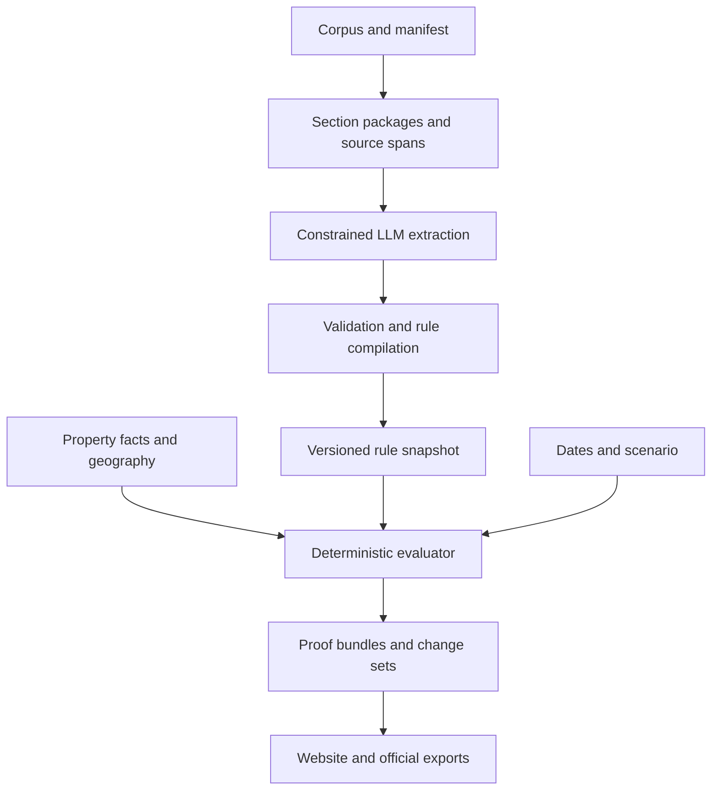

# RuleTwin Housing: research review and 15-hour MVP

Research checked: 4 October 2026. Team: two people; budget: 15 elapsed hours, approximately 30 person-hours.

**Recommendation:** build an address-and-date website with an evidence receipt, a missing-fact checklist, and a before/after change view. Use an LLM to propose structured rules; use deterministic code to evaluate them. Call the output a **replayable applicability trace**, not a guarantee of legal correctness. A correct interpreter cannot prove that the extracted interpretation is legally correct.

I read the complete challenge analysis, research report, and six-page challenge brief. The brief supplies the problem statement omitted from the prompt. It confirms 87 source documents, 500 sample properties, six categories, three states, ten extraction cities but nine sampled cities, and 75 automated points. The brief—not an independently verified legal opinion—is the authority for the competition facts below. The actual corpus, participant guide, schemas, dev key, and `score.py` were not among the three attachments, so no scorer was run and no score is claimed.

The brief also says its key contains 58 rules and 19 negative findings; only 52 rules were source-verified, and the key was not reviewed by counsel. Consequently, competition agreement and legal correctness must be tracked separately.

## 1. Reviewed and extended challenge table

Severity: **C** = can invalidate legal results or submission; **H** = substantial accuracy, trust, or delivery risk; **M** = manageable operational risk. C1–C27 preserve the original document's challenge numbering. Mitigations are engineering recommendations; research links appear in section 4.

| ID / challenge | Root cause | Concrete failure mode | Severity | Review and minimum mitigation |
|---|---|---|---|---|
| C1 Source/PDF/Unicode integrity | OCR, ligatures, destructive normalization | Correct-looking quote fails corpus match; comparator changes | C | Strong coverage. Preserve original text and hashes; emit quotes from original spans. Starter corpus is already plain text, so defer a general PDF/OCR pipeline. |
| C2 Clause segmentation | Lists, hierarchy, distant exceptions | Obligation separated from its qualification | C | Keep subsection, lead-in, definitions and reference links together; mark incomplete reference expansion. |
| C3 Rule granularity/identity | One section contains multiple effects | Duplicate rules or mismatched scorer records | H | Stable conceptual ID plus version ID; separate atomic engine rules from official export grouping. |
| C4 Operative language | Findings, permission and obligation look similar | Descriptive text becomes a binding requirement | H | Extract actor, modality, action, trigger and effect separately. |
| C5 Boolean scope/exceptions | Nested conjunctions and defeaters | Small-owner exemption silently disappears | C | Recursive condition tree; each branch has source evidence; inspect every exception cue. |
| C6 Definitions | Same term has jurisdiction-specific meaning | Wrong definition broadens coverage | C | Resolve within legal scope; unresolved imported definition blocks a confident result. |
| C7 Numbers/formulas | Mixed units, CPI, written numbers | Treat 1.5 months as $1.50; invent current cap | H | Typed decimal values and units; retain formula if required inputs are missing. |
| C8 Dates/status | Signature, operation and applicability diverge | Pending proposal becomes law when its date passes | C | Separate status events, effective intervals and transaction triggers; test start/sunset boundaries. |
| C9 Citations | Exact quote mistaken for full support | Real citation attached to unsupported exemption | C | Check existence, exactness, field relevance and sufficiency separately. |
| C10 Geocoding | Postal city differs from legal boundary | Neighboring city's ordinance applies | C | Canonical geography IDs; cached geocoder evidence; ambiguity produces unknown. |
| C11 Parcel/fact joins | Parcel, building and unit are different entities | Condo gets master-building unit count | C | Preserve supplied property IDs, entity level and raw fields; no silent many-to-one joins. |
| C12 Three-valued logic | Missing value treated as false | Unknown ownership produces a definite answer | C | Strong Kleene true/false/unknown; separate missing, conflicting and unsupported facts. |
| C13 Precedence/preemption | No universal local-versus-state shortcut | Entire state statute suppressed by one local clause | C | Evidence-backed, dated, provision-level relationships; unresolved conflict has no invented winner. |
| C14 Negative findings | Search absence confused with legal absence | “No protections” despite incomplete corpus | C | Distinguish affirmative negative authority, corpus no-match and unknown. |
| C15 Law-change impact | Rule-ID diff ignores semantic changes | Changed cap/exemption omitted from affected set | C | Compare canonical effects, status, uncertainty and conflicts at fixed facts and dates. |
| C16 Retrieval completeness | Top-k retrieves only obvious provisions | Missed obligation despite perfect citations on returned rules | C | Enumerate all sections of 87 documents; retrieve references for context, not to limit rule discovery. |
| C17 Extraction variability | Valid JSON can still be wrong | Repeat run changes dates or exceptions | C | Schema, span and semantic checks; bounded repair; freeze validated artifacts. |
| C18 Indirect prompt injection | Legal documents contain adversarial instructions | Extractor changes jurisdiction or omits restrictions | H | Tool-free extraction; allowlisted DSL; source text is data; attack tests. Prompts alone are insufficient. |
| C19 Compilation | Unsupported operators and coercions | String “false” becomes true | C | Typed field registry; no `eval`; unsupported atoms yield explicit unknown. |
| C20 Serialization | Internal enums differ from official contract | Correct answer receives no credit | C | Adapter plus official schema/scorer; check null versus omitted and stable ordering. |
| C21 Explanation | LLM independently re-reasons | UI contradicts exported result | H | Template summaries from evaluated trace; expandable evidence and missing facts. |
| C22 Evaluation/ground truth | Tiny, imperfect key; correlated model judges | Higher dev score hides systematic omission | C | Root-cause error ledger; source-audited fixtures; mutation tests; separate key disagreement. |
| C23 Observability | Errors disappear between stages | Missing file/rule is unnoticed | H | Manifest ledger: processed, rejected or unresolved for every document and candidate. |
| C24 Performance | Network/model work dominates | Timeout forces incomplete submission | H | Bounded concurrency, resumable extraction, cached geography; local batch evaluation. |
| C25 Coordination/reproducibility | Five workstreams for two people | Integration consumes final hours | C | Two owners, one frozen interface, integration gates; artifact replay distinct from model rerun. |
| C26 Deployment/demo | Live APIs and late deployment | Working notebook but broken website | C | Deploy shell by hour 1; stored snapshot fallback; live extraction status and errors visible. |
| C27 Trust/liability/responsible use | Footer substitutes for safe behavior | Compliance certification or evasion assistance | C | Persistent scope/date/source labels; no compliance badge, evasion advice or tenant-ranking endpoint. |
| N1 **NEW: bitemporal facts and transaction context** | Current property facts applied to historical tenancy | Present ownership used for past deposit transaction | C | Version facts as well as law; distinguish legal date, knowledge date, tenancy start and event date. If unsupported, label “historical law using current supplied facts.” |
| N2 **NEW: amendment editing instructions** | Session law is a patch, not consolidated law | Deleted text and replacement both become active | C | Explicit add/delete/replace operations against an identified base version; preserve patch source; quarantine ambiguous consolidation. |
| N3 **NEW: logical consistency and cycles** | Duplicated/cyclic rules or impossible predicates | Two active versions; `units < 2 AND units > 10` | C | Check cycles, overlapping version intervals and simple contradictions; bounded evaluation depth. |
| N4 **NEW: counter-exceptions and alternative effects** | Flat exemptions only switch a rule off | Exception actually changes cap; exception-to-exception lost | C | Recursive guard tree and distinct effect branches, including defeat relations. Never assume every “except” means no rule. |
| N5 **NEW: effect-level uncertainty** | Applicability and amount conflated | Rule applies, but unknown CPI displayed as a definite amount | H | Separate coverage truth from effect completeness; formula can be known while numeric result is unknown. |
| N6 **NEW: fair-housing misuse and proxy discrimination** | Property information repurposed for screening or targeting | Neighborhood becomes proxy for tenant eligibility | C | No resident scoring, protected-trait inference, rent optimization or avoidance recommendations. Check that irrelevant person attributes cannot affect outputs. |
| N7 **NEW: source authority and completeness gates** | Hash proves integrity, not official authority or complete law | Tamper-evident but unauthoritative result looks certified | C | Separate integrity, authority, semantic support and corpus coverage indicators; no “verified law” badge. |
| N8 **NEW: safe rendering and upload handling** | Evidence rendered as active HTML; arbitrary URLs fetched | XSS, oversized upload or server-side URL abuse | H | Escape all source text; bound upload size; disable arbitrary URL fetching in MVP; sanitize citation schemes. |
| N9 **NEW: benchmark contract versus legal truth** | Answer key itself is partly unverified | Team silently changes legal output to match key | C | Record `key_disagreement`; retain source-supported interpretation; ask organizers to adjudicate, not hardcode addresses. |
| N10 **NEW: launch schedule conflict** | Only 15 hours of work, surprise data at event hour 16 | T6 cannot be completed before release | C | Leave a prebuilt ingestion command and reserve hands-on time after release; elapsed project time must accommodate availability. |

**Weaknesses to correct immediately:** the analysis's interval sentence is truncated; normalize interpreted dates to `[start, end_exclusive)`. Its “remove required fact” invariant needs a relevance condition: deleting a fact from a decisive false conjunct can change false to unknown; it must never create unsupported true. Its state-rule city-invariance test also needs a caveat for laws explicitly conditioned on local regimes. A fixed two-hop reference expansion is a budget, not proof of closure. Do not advertise “all exceptions verified” from keyword counts.

The research attachment's bibliography is unreliable: reference [2] points to Census geocoding while the text uses it for temporal statutory QA; [3] points to a different extraction paper while cited for LegisSearch; [6] points to a geocoder endpoint while cited for LegalBench-RAG. The papers must be re-linked individually. The verified replacements below supersede those numbered references. Also, source authority is not a fixed ranking by document type: a controlling new enactment can supersede a stale consolidated code page.

## 2. Current implementations table

Capabilities: **A** address-level housing lookup; **T** temporal law; **D** deterministic rules; **C** citations/provenance; **Δ** law-change simulation. “Custom” means possible after substantial encoding; “not documented” is not a claim of impossibility. Repository licenses are separate from model, data and hosted-service licenses.

| System / source | What it does; stack | License/access verified | Reuse | Relevant limits |
|---|---|---|---|---|
| [JustFix tenant platform](https://github.com/JustFixNYC/tenants2) | Tenant assistance workflows; Django/Python, Node frontend, PostgreSQL/PostGIS | GPL-3.0 for this repository | Address handling and accessible tenant workflow patterns | A: NYC workflows; general T/D/Δ housing-rule engine not documented. Forking an entire older platform is too costly. |
| [Landlord–Tenant Rights Bot, Subedi, ACM Interactions 2025](https://interactions.acm.org/archive/view/november-december-2025/empowering-tenants-and-landlords-through-conversational-ai-for-housing-rights) | Published housing-rights conversational prototype; article identifies Hugging Face-hosted components | Public article indexed; full page fetch blocked; code license and exact backend **unverified** | Comparative RAG baseline, if code becomes accessible | Publication exists. State-summary RAG description comes from the request; exact model/vector DB, live Space, A/T/D/C/Δ not independently established. Do not pretend it is an audited reusable repo. |
| [JusticeBot](https://arxiv.org/abs/2308.02032) | Hybrid case-based and rule-based layperson support; landlord–tenant deployment case study | Paper verified; implementation license not established | Guided questions and comparable-case explanations | Important tenant-specific prior art. No verified complete multi-city, as-of-date parcel/change pipeline. |
| [OpenFisca](https://github.com/openfisca/openfisca-core), [reforms](https://openfisca.org/doc/key-concepts/reforms.html) | Python/NumPy rules-as-code, periods, simulations and APIs | AGPL-3.0 core | Baseline/reform comparison, dated parameters, [execution traces](https://openfisca.org/doc/simulate/analyse-simulation.html) | T/D/Δ supported; A and housing laws custom; citations depend on model authors. Default values need scrutiny for unknown facts. |
| [Catala](https://github.com/CatalaLang/catala) | Legal programming language, default/exception semantics, OCaml compiler | Apache-2.0 unless subdirectory says otherwise | Semantics, literate source/code correspondence, tests | D supported; A/T/Δ domain models custom. Automatic statute interpretation is not supplied merely by the compiler. |
| [Blawx](https://github.com/Lexpedite/blawx) | Django + Blockly + SWI-Prolog/s(CASP); explanations and hypothetical reasoning | MIT repository; described as experimental, not production-ready | Scenario explorer and unknown-input reasoning ideas | D/C and hypotheticals are prior art; A and historical law need modeling. Hosted offerings may differ from this repository. |
| [DMN / dmn-js](https://github.com/bpmn-io/dmn-js), [OMG DMN](https://www.omg.org/dmn/) | Browser decision-table/diagram editing; JavaScript, DMN XML/FEEL ecosystem | dmn-js uses bpmn.io license, **not plain MIT**; inspect watermark clause | Table presentation and authoring patterns | dmn-js is an editor, not a legal interpreter. D requires an engine; legal precedence, T/A/C/Δ require modeling. |
| [LegalRuleML](https://www.oasis-open.org/standard/legalruleml-core-specification-version-1-0-oasis-standard/), [reasoning bridge](https://arxiv.org/abs/1711.06128) | XML normative representation; transformation to modal defeasible logic | OASIS specification terms; implementation licenses vary | Vocabulary for modality, overrides and temporal qualifications | Representation standard, not turnkey extraction, GIS or website. Full adoption is too large for this MVP. |
| [docassemble](https://github.com/jhpyle/docassemble) | Python/YAML/Markdown expert interviews and document assembly | MIT | Ask only needed facts; legal-aid interaction patterns | Rules/interviews authored for each domain; no automatic municipal corpus compiler. |
| [STARA](https://reglab.github.io/stara/) | Context-enriched provision classification and statutory surveys | Survey datasets public; research tool available on request; no general code license verified | Exhaustive section inventory and legal context packaging | Retrieval/extraction, not property application; not an immediately available licensed backend. |
| [Jurayj et al. legal_logic_programs](https://github.com/wjurayj/legal_logic_programs) | Python/model calls + SWI-Prolog experiments on tax statutes | Public repository; no license established from inspected root | Experimental design and parsing/execution separation | Tax/SARA, not housing; do not assume permission to copy unlicensed code. |
| [LegisSearch](https://github.com/andreac0/LegisSearch) | Neo4j legal graph, embeddings and LLM-assisted legislative navigation | Repo verified; license not established in this inspection | Explicit citation/amendment/repeal edges | Italian legislative retrieval; neither parcel applicability nor a demonstrated complete housing simulator. |
| [HousingQA on Hugging Face](https://huggingface.co/datasets/isaacus/mteb-housing-qa) | Housing-law retrieval benchmark in MTEB corpus/query/qrels format | CC-BY-SA-4.0 on inspected dataset; derived from `reglab/housing_qa` | Optional retrieval stress test after competition tests | Dataset, not rules engine; no property facts, law-version proof or change-set benchmark. |
| [De Jure](https://arxiv.org/abs/2604.02276) | Structured rule extraction with judge-guided bounded repair | Paper/prompts/schema accessible; public implementation license not verified | Extraction rubric and repair ordering | Does not establish deterministic housing applicability; LLM-judge preference is not legal ground truth. |

## 3. Prior-art gaps

**No inspected single implementation documented the entire combination:** automated extraction from new municipal text; parcel-level applicability; explicit missing-fact reasoning; temporal status and preemption; exact source support; and definite/possible address-level change impact with replayable artifacts.

That is a bounded search finding, not proof that no such system exists. Private systems and unindexed repos remain outside this review.

| Tempting novelty claim | Why it is too broad | Defensible narrower contribution |
|---|---|---|
| “AI plus symbolic legal rules” | Catala, L4L and Prolog statutory work already cover this | Corpus-to-address integration with measured fidelity and abstention |
| “Explainable legal answers” | Blawx, JusticeBot and claim/evidence interfaces exist | One receipt joining source branch, property fact, date and precedence result |
| “Simulate a law change” | OpenFisca reforms already do it | Housing-specific changes with unresolved-fact bounds and source-backed proof deltas |
| “Versioned legal knowledge graph” | Akoma Ntoso and temporal graph research exist | Correct historical property context plus lightweight replay in this particular pipeline |
| “Mutation testing for laws” | Padhye explicitly proposes it | Exception-by-exception mutation witnesses exposed within the property proof interface |

The research contribution worth testing is **whether this integration reduces omitted applicable rules and unsupported certainty under new-law ingestion**, compared with direct RAG and unvalidated extraction. Do not describe all ten ideas below as globally new inventions.

## 4. Research papers table per challenge

P-numbers are the exact sources used in the hybrids. A source may cover several challenges. “Transfer” describes our proposed adaptation, not a result already demonstrated in housing. Standards and operational documentation are identified explicitly where they are better evidence than a loosely related paper.

| ID / verified paper or primary source | Challenges covered | Useful result or technique; limitation |
|---|---|---|
| P1 Auer et al., 2024, [Docling Technical Report](https://arxiv.org/abs/2408.09869), technical report | C1–2 | Layout-aware PDF conversion. Use only if new input requires it; extraction does not preserve legal meaning automatically. |
| P2 Surani et al., 2025, [What Is the Law? A System for Statutory Research (STARA) with Large Language Models](https://reglab.github.io/stara/), ICAIL | C2–4, C6, C14, C16, C22–24, N7 | Exhaustive provision surveys with statutory context. High recall in its studied tasks is not a housing accuracy guarantee. |
| P3 Guliani et al., 2026, [De Jure: Iterative LLM Self-Refinement for Structured Extraction of Regulatory Rules](https://arxiv.org/abs/2604.02276), preprint | C2–7, C17, C22, C24, N4 | Metadata/definition/rule assessment and bounded repair. Judge-based scores and QA preferences do not prove truth or omitted-rule recall. |
| P4 Chen et al., 2026, [From Statute to Control Flow: Span-Grounded Deontic Trees for Defeasible Scope Parsing](https://arxiv.org/abs/2606.08932) | C2, C5–6, C9, C19, N3–4 | Source-linked logical branches, exclusion guards and silent-scope-omission diagnosis. Relevant-span retrieval alone does not ensure correct control flow. |
| P5 Horner, Mateis, Governatori & Ciabattoni, 2025, [Toward Robust Legal Text Formalization into Defeasible Deontic Logic using LLMs](https://arxiv.org/abs/2506.08899), preprint | C3–7, C13, C17, C19, N3–4 | Separate coverage, syntax, modality, conditions and semantic correctness; avoid treating valid JSON as a correct rule. |
| P6 Chen, Cai, Hou & Dong, 2025/2026 revision, [Towards Trustworthy Legal AI through LLM Agents and Formal Reasoning (L4L)](https://arxiv.org/abs/2511.21033), preprint | C5, C13, C19, C21, N3, N7 | Autoformalization plus SMT verification. Solver checks are conditional on encoded rules/facts; multi-agent adjudication is unnecessary for the MVP. |
| P7 Merigoux, Chataing & Protzenko, 2021, [Catala: A Programming Language for the Law](https://arxiv.org/abs/2103.03198), PACMPL | C3, C5, C7, C13, C19, N3–4 | Default/exception semantics and verified core compilation. Compiler correctness does not certify a legal interpretation. |
| P8 Holzenberger & Van Durme, 2021, [Factoring Statutory Reasoning as Language Understanding Challenges](https://aclanthology.org/2021.acl-long.213/), ACL-IJCNLP | C6–7, C11–12, C19, C22 | Decomposes statutory reasoning into language-understanding and symbolic subtasks; SARA is tax-focused, not a municipal housing oracle. |
| P9 Jurayj, Holzenberger & Van Durme, 2025 preprint / AAAI 2026, [Language Models and Logic Programs for Trustworthy Tax Reasoning](https://arxiv.org/abs/2508.21051) | C7, C12, C17, C19, C22, N5 | Translate text to executable logic, separate calculation from parsing, evaluate abstention. Gold formalizations and exemplars affect results. |
| P10 Prior, Schultz & Grabmair, 2026, [Asking For An Old Friend: Diagnosing and Mitigating Temporal Failure Modes in LLM-based Statutory Question Answering](https://arxiv.org/abs/2605.23497) | C8, C14–16, N1–2 | Distinguishes staleness from recency bias; date-constrained retrieval. German statutory QA evidence does not solve US retroactivity. |
| P11 de Martim, 2025, [A Temporal FRBR/FRBRoo-Based Model for Component-Level Versioning of Legal Norms](https://arxiv.org/abs/2506.07853), preprint | C3, C6, C8, C15, N1–2 | Component identities and temporal versions; useful for amendment lineage. |
| P12 de Martim, 2025, [An Ontology-Driven Graph RAG for Legal Norms: A Structural, Temporal, and Deterministic Approach](https://arxiv.org/abs/2505.00039), JURIX reference on arXiv | C6, C8–9, C15, C23, N1–2, N7 | Legislative actions and point-in-time provenance. Inspected revision explicitly describes a conceptual architecture/case study, not an extensively benchmarked production engine. |
| P13 Colombo et al., 2025, [LegisSearch: navigating legislation with graphs and large language models](https://doi.org/10.1007/s10506-025-09482-6), Artificial Intelligence and Law | C2, C6, C8, C15–16, N2 | Explicit legislative graph plus retrieval. Graph relationships still require accurate extraction and interpretation. |
| P14 Pipitone & Houir Alami, 2024, [LegalBench-RAG: A Benchmark for Retrieval-Augmented Generation in the Legal Domain](https://arxiv.org/abs/2408.10343), preprint | C1–2, C9, C16, C22 | Minimal relevant span retrieval and evaluation. Use document/character support; not evidence that every cited claim is entailed. |
| P15 Reuter et al., 2025, [Towards Reliable Retrieval in RAG Systems for Large Legal Datasets](https://arxiv.org/abs/2510.06999), NLLP | C9, C16 | Document-level retrieval mismatch and summary-augmented chunks. Metadata/date filters remain necessary. |
| P16 Magesh et al., 2024, [Hallucination-Free? Assessing the Reliability of Leading AI Legal Research Tools](https://arxiv.org/abs/2405.20362) | C9, C17, C21–22, C27, N7 | Demonstrates why retrieval-backed legal products still need factuality auditing. Do not transplant historical error rates to today's models. |
| P17 Greshake et al., 2023, [Not what you've signed up for: Compromising Real-World LLM-Integrated Applications with Indirect Prompt Injection](https://arxiv.org/abs/2302.12173), AISec | C18, N8 | Retrieved content can redirect behavior; separate source data from execution privileges. |
| P18 Padhye, 2024, [Software Engineering Methods For AI-Driven Deductive Legal Reasoning](https://arxiv.org/abs/2404.09868), Onward! | C5, C7–8, C19, C22, C25–26, N3–4 | Mutation-guided examples and metamorphic testing already exist in legal reasoning. Tests expose inconsistencies; they do not replace legal labels. |
| P19 Wang & Zhu, 2024, [Validating LLM-Generated Programs with Metamorphic Prompt Testing](https://arxiv.org/abs/2406.06864), preprint | C17–18, C22, C25, N8 | Cross-check outputs under meaning-preserving transformations. Tested on generated code; legal adaptation is a hypothesis. |
| P20 Martin-Boyle et al., 2026, [PaperTrail: A Claim-Evidence Interface for Grounding Provenance in LLM-based Scholarly Q&A](https://arxiv.org/abs/2602.21045), CHI | C9, C21, C27, N7 | Fine-grained evidence UI. Study found reduced trust without corresponding behavioral change: transparency alone is insufficient. |
| P21 [JusticeBot: A Methodology for Building Augmented Intelligence Tools for Laypeople to Increase Access to Justice](https://arxiv.org/abs/2308.02032), 2023 | C12, C21, C27, N6 | Hybrid legal support with layperson-facing questions and a housing case study; independent of full address/time modeling. |
| P22 Radford, 2021, [Regressing Location on Text for Probabilistic Geocoding](https://arxiv.org/abs/2107.00080), CASE | C10–11 | Uncertainty-aware geocoding concept. Event-text geocoding is not a validated parcel/address uncertainty model; use official geocoder evidence operationally. |
| P23 Montenegro et al., 2026, [LLM-Assisted Ontology Engineering and Construction of a French Legal Knowledge Graph](https://arxiv.org/abs/2607.24551), preprint, indexed abstract verified | C6, C13, C17, C19, N3 | Ontology-first construction; predicate normalization and relation-signature validation. Full paper fetch unavailable; no quantitative claim adopted. |
| P24 [InsufficiencyBench: Evaluating LLM legal advice on underspecified user queries](https://huggingface.co/papers/2608.20220), 2026, indexed paper record | C11–12, C21–22, N1, N5 | Tests recognition of missing legally material facts. Full arXiv fetch failed; used only as verified related-work existence, not implementation evidence. |
| S1 [Akoma Ntoso 1.0](https://www.oasis-open.org/standard/akn-v1-0/), OASIS standard | C1–3, C6, C8, N1–2 | Structured legal documents, identity and temporal metadata; not a rule executor. |
| S2 [LegalRuleML](https://www.oasis-open.org/standard/legalruleml-core-specification-version-1-0-oasis-standard/) and [Lam & Hashmi's reasoning bridge](https://arxiv.org/abs/1711.06128) | C4–6, C13, C19, N3–4 | Formal normative vocabulary and defeasible reasoning; heavy integration deferred. |
| S3 [Census Geocoder documentation](https://www.census.gov/programs-surveys/geography/technical-documentation/complete-technical-documentation/census-geocoder.html) | C10–11 | Official benchmark/vintage and address-resolution documentation. Use provenance; do not equate interpolated points with rooftop accuracy. |
| S4 [OpenFisca reform](https://openfisca.org/doc/key-concepts/reforms.html), [trace](https://openfisca.org/doc/simulate/analyse-simulation.html), [boundary-test documentation](https://openfisca.org/doc/coding-the-legislation/writing_yaml_tests.html) | C7–8, C15, C19, C22–26, N5 | Operational precedents for baseline comparison, tracing and tests. Deployment/time estimates here remain engineering judgment. |
| S5 [OWASP prompt injection](https://genai.owasp.org/llmrisk/llm01-prompt-injection/) and [NIST GenAI profile](https://nvlpubs.nist.gov/nistpubs/ai/NIST.AI.600-1.pdf) | C18, C23, C25–27, N6–8 | Security/risk-management primary guidance, not empirical housing papers. |
| S6 [HUD 2024 AI/screening guidance announcement, archived](https://archives.hud.gov/news/2024/pr24-098.cfm) | C27, N6 | Historical evidence of screening/advertising misuse concerns. Not asserted to be current 2026 legal guidance. |

For C20, N9 and N10, the official competition contract and brief are the best evidence. No paper establishes its enum mappings, scoring semantics, or release schedule. For N8's XSS/upload controls, ordinary web security is appropriate; a legal-AI paper is not required to justify escaping untrusted text.

## 5. Proposed architecture and plan

### Architecture and website

Prefer the supplied starter stack. If it provides no usable application: a small React/Vite frontend, Python FastAPI API, SQLite plus immutable JSON artifacts. Use the team's familiar alternatives if already scaffolded. No vector database, graph database or solver is required for 500 properties.



**One website, three views:** (1) address + date → six category cards with status; (2) expand a card → decisive facts, missing facts, original clauses and precedence; (3) compare two dates or a pending-law scenario → changed addresses and explanations. An administrative ingestion panel shows progress for the surprise ordinance.

**API contract:** `GET /properties`; `POST /lookup` with property ID and explicit date; `POST /changes` with baseline/target date, snapshot and scenario; `GET /proofs/{id}`; restricted `POST /ingestions` for trusted event uploads. Jobs write new snapshots atomically; lookups pin a snapshot ID, so a partially extracted law cannot appear mid-query.

**Compiler:** JSON schema → reference existence → span check → typed operators → date/status consistency → supported branch/priority checks. Compilation builds a safe expression tree; it does not execute generated Python, Prolog, SQL or JavaScript. Unresolved predicates remain visible as unknown. Exhaustive section classification plus targeted reference expansion is enough for this corpus; lexical search is optional for the source viewer.

**Evaluation:** resolve jurisdiction, select legal/status version, evaluate coverage/effects, then evidence-backed priority. Keep these dimensions independent. `false AND unknown = false`; `true AND unknown = unknown`; `true OR unknown = true`; `NOT unknown = unknown`. A statutory requirement for absence of a thing is different from database absence of a value. Do not implement a generic `exists(fact)` that converts missing data into legal false.

**Temporal contract:** use calendar dates and interpreted half-open intervals. A retroactive provision can refer to an earlier transaction even if promulgated later; this needs transaction predicates and a knowledge cutoff, not just `effective_from <= today`. Unsupported retroactivity or mixed provision dates go to review. Pending simulations use an explicit overlay; never edit actual enactment status.

**Facts:** construction year is not a certificate-of-occupancy date. Where year precision alone crosses a date cutoff, return unknown. An owner fact can belong to an owner/portfolio, not to a building. Preserve entity level and provenance.

**Change computation:** for a fixed fact snapshot, evaluate both rule snapshots/dates and diff semantic signatures: category, effect/formula, coverage, status, precedence and conflict. A textual rewrite with identical behavior should not be counted as a substantive legal impact. Separately show provenance-only changes. For 500 rows, reevaluate everything; dependency-driven incremental processing is a later optimization.

### JSON schemas

This is an **internal Draft 2020-12 schema bundle**, not the unknown official submission schema. Its `$defs.rule`, `$defs.fact` and `$defs.proof` are the three schemas. Validate `format` explicitly in your validator. Evidence links, intervals, field/operator types, recursive complexity limits and quote support also require semantic validation; JSON Schema cannot enforce legal meaning.

```json
{
  "$schema": "https://json-schema.org/draft/2020-12/schema",
  "$id": "urn:ruletwin:housing:internal:v1",
  "oneOf": [{"$ref":"#/$defs/rule"},{"$ref":"#/$defs/fact"},{"$ref":"#/$defs/proof"}],
  "$defs": {
    "id": {"type":"string","minLength":1},
    "dateOrNull": {"type":["string","null"],"format":"date"},
    "ids": {"type":"array","items":{"$ref":"#/$defs/id"},"uniqueItems":true},
    "evidence": {"type":"array","items":{"$ref":"#/$defs/id"},"minItems":1,"uniqueItems":true},
    "truth": {"enum":["true","false","unknown"]},
    "interval": {
      "type":"object","additionalProperties":false,"required":["from","to_exclusive"],
      "properties":{"from":{"$ref":"#/$defs/dateOrNull"},"to_exclusive":{"$ref":"#/$defs/dateOrNull"}}
    },
    "expr": {
      "oneOf":[
        {"type":"object","additionalProperties":false,"required":["op","args","evidence"],
         "properties":{"op":{"enum":["all","any"]},"args":{"type":"array","minItems":1,"items":{"$ref":"#/$defs/expr"}},"evidence":{"$ref":"#/$defs/evidence"}}},
        {"type":"object","additionalProperties":false,"required":["op","arg","evidence"],
         "properties":{"op":{"const":"not"},"arg":{"$ref":"#/$defs/expr"},"evidence":{"$ref":"#/$defs/evidence"}}},
        {"type":"object","additionalProperties":false,"required":["op","field","value","evidence"],
         "properties":{"op":{"enum":["eq","ne","lt","le","gt","ge","in"]},"field":{"$ref":"#/$defs/id"},"value":{"type":["string","number","boolean","array"]},"unit":{"type":"string"},"evidence":{"$ref":"#/$defs/evidence"}}},
        {"type":"object","additionalProperties":false,"required":["op","value","evidence"],
         "properties":{"op":{"const":"constant"},"value":{"type":"boolean"},"evidence":{"$ref":"#/$defs/evidence"}}},
        {"type":"object","additionalProperties":false,"required":["op","reason","evidence"],
         "properties":{"op":{"const":"unsupported"},"reason":{"type":"string"},"evidence":{"$ref":"#/$defs/evidence"}}}
      ]
    },
    "rule": {
      "type":"object","additionalProperties":false,
      "required":["kind","norm_id","version_id","jurisdiction_id","category","modality","status","effective","known_from","coverage","effects","relations","field_evidence","validation"],
      "properties":{
        "kind":{"const":"rule"},"norm_id":{"$ref":"#/$defs/id"},"version_id":{"$ref":"#/$defs/id"},
        "jurisdiction_id":{"$ref":"#/$defs/id"},
        "category":{"enum":["rent_increase","just_cause","deposit","application_fee","screening_restriction","algorithmic_pricing"]},
        "modality":{"enum":["obligation","prohibition","permission","definition","negative_finding"]},
        "status":{"enum":["enacted","pending","failed","withdrawn","invalidated","suspended","unknown"]},
        "effective":{"$ref":"#/$defs/interval"},"known_from":{"type":"string","format":"date-time"},
        "known_to_exclusive":{"type":["string","null"],"format":"date-time"},
        "status_evidence":{"$ref":"#/$defs/evidence"},"coverage":{"$ref":"#/$defs/expr"},
        "effects":{"type":"array","minItems":1,"items":{
          "type":"object","additionalProperties":false,"required":["effect_id","guard","type","value_text","unit","evidence"],
          "properties":{"effect_id":{"$ref":"#/$defs/id"},"guard":{"$ref":"#/$defs/expr"},"type":{"enum":["cap","prohibition","requirement","permission","negative_finding"]},"value_text":{"type":"string"},"unit":{"type":["string","null"]},"evidence":{"$ref":"#/$defs/evidence"}}
        }},
        "relations":{"type":"array","items":{
          "type":"object","additionalProperties":false,"required":["type","target_version_id","guard","effective","evidence"],
          "properties":{"type":{"enum":["supersedes","amends","repeals","preempts","potentially_preempts","supplements","conflicts_with"]},"target_version_id":{"$ref":"#/$defs/id"},"guard":{"$ref":"#/$defs/expr"},"effective":{"$ref":"#/$defs/interval"},"evidence":{"$ref":"#/$defs/evidence"}}
        }},
        "field_evidence":{"type":"object","additionalProperties":{"$ref":"#/$defs/evidence"}},
        "validation":{"enum":["accepted","review","rejected"]}
      }
    },
    "fact": {
      "type":"object","additionalProperties":false,
      "required":["kind","fact_id","entity_id","entity_level","field","state","value","raw_value","precision","valid","known_at","source_ref"],
      "properties":{
        "kind":{"const":"fact"},"fact_id":{"$ref":"#/$defs/id"},"entity_id":{"$ref":"#/$defs/id"},
        "entity_level":{"enum":["parcel","building","unit","owner","tenancy"]},"field":{"$ref":"#/$defs/id"},
        "state":{"enum":["known","missing","conflicting","not_equivalent"]},
        "value":{"type":["string","number","boolean","null"]},"raw_value":{"type":["string","number","boolean","null"]},
        "precision":{"enum":["exact","year","approximate","unknown"]},"unit":{"type":["string","null"]},
        "valid":{"$ref":"#/$defs/interval"},"known_at":{"type":"string","format":"date-time"},"source_ref":{"type":["string","null"]}
      },
      "allOf":[{"if":{"properties":{"state":{"const":"known"}}},"then":{"properties":{"value":{"not":{"type":"null"}},"source_ref":{"$ref":"#/$defs/id"}}},"else":{"properties":{"value":{"type":"null"}}}}]
    },
    "span": {
      "type":"object","additionalProperties":false,"required":["span_id","document_id","source_hash","start","end","quote","citation","source_url","retrieved_at"],
      "properties":{"span_id":{"$ref":"#/$defs/id"},"document_id":{"$ref":"#/$defs/id"},"source_hash":{"type":"string","pattern":"^[a-f0-9]{64}$"},"start":{"type":"integer","minimum":0},"end":{"type":"integer","minimum":1},"quote":{"type":"string","minLength":1},"citation":{"type":"string"},"source_url":{"type":"string","format":"uri"},"retrieved_at":{"type":"string","format":"date-time"}}
    },
    "trace": {
      "type":"object","additionalProperties":false,"required":["node_id","rule_version_id","result","fact_ids","span_ids","children"],
      "properties":{"node_id":{"$ref":"#/$defs/id"},"rule_version_id":{"$ref":"#/$defs/id"},"result":{"$ref":"#/$defs/truth"},"fact_ids":{"$ref":"#/$defs/ids"},"span_ids":{"$ref":"#/$defs/evidence"},"children":{"type":"array","items":{"$ref":"#/$defs/trace"}},"reason":{"type":"string"}}
    },
    "proof": {
      "type":"object","additionalProperties":false,
      "required":["kind","proof_id","property_id","as_of_date","knowledge_cutoff","scenario_id","snapshot_hash","engine_version","rule_versions","fact_ids","coverage","status","effect_complete","missing_fields","conflicts","trace","spans"],
      "properties":{
        "kind":{"const":"proof"},"proof_id":{"$ref":"#/$defs/id"},"property_id":{"$ref":"#/$defs/id"},
        "as_of_date":{"type":"string","format":"date"},"knowledge_cutoff":{"type":"string","format":"date-time"},
        "scenario_id":{"type":["string","null"]},"snapshot_hash":{"type":"string","pattern":"^[a-f0-9]{64}$"},"engine_version":{"$ref":"#/$defs/id"},
        "rule_versions":{"$ref":"#/$defs/evidence"},"fact_ids":{"$ref":"#/$defs/ids"},"coverage":{"$ref":"#/$defs/truth"},
        "status":{"enum":["applies","does_not_apply","unknown","pending","not_yet_effective","superseded","expired","failed","conflict"]},
        "effect_complete":{"type":"boolean"},"missing_fields":{"$ref":"#/$defs/ids"},"conflicts":{"$ref":"#/$defs/ids"},
        "trace":{"$ref":"#/$defs/trace"},"spans":{"type":"array","minItems":1,"items":{"$ref":"#/$defs/span"}}
      }
    }
  }
}
```

Schema design notes: `value_text` preserves an amount/formula for display; never execute it. Add a typed arithmetic AST only if the scorer requires formula evaluation. Every effect branch has its own guard; counter-exceptions are represented by nesting guards or separate, explicitly prioritized effects. In this minimal model, `from: null` means unknown start, never “always effective”; `to_exclusive: null` means no encoded end. If an end is legally ambiguous, the rule must remain `validation: review`, not enter the active snapshot as indefinitely valid. Do not export these internal enums before inspecting the official schema. A proof references immutable rule/fact snapshots; its hash proves content identity, not correctness or independent authenticity.

### Fifteen-hour build plan

| Elapsed hours | Person A: extraction/data | Person B: engine/website | Integration gate |
|---|---|---|---|
| 0–1 | Inspect corpus, schema, score script; one document fixture | Deploy website shell; pin API/IR contract | One rule and one lookup serialize successfully |
| 1–4 | Automated section extraction, span lookup, cache, rejection ledger | Three-valued evaluator, typed fields, date/status tests | One full source → address → evidence card path |
| 4–7 | Run all 87 documents; repair high-impact omissions | Normalize 500 properties/geography; batch evaluator | Full exports; first real dev score |
| 7–10 | Exception/date/source audits; unseen-ordinance rehearsal | T1–T6-shaped scenario engine and semantic diff; change UI | All available official tests run |
| 10–12 | Fix largest scorer error classes; reserve surprise-ingestion slot | Missing-fact checklist, proof receipt, conflict rendering | Stable baseline with no unsupported applies |
| 12–14 | Re-run scoring; corpus completeness review | Deployment smoke check; cached fallback; exports | Freeze best validated snapshot |
| 14–15 | Joint demo and technical videos, score evidence, README | Same | Deliver runnable repo, files and live URL |

This budget includes the simple missing-fact and proof-delta features. A full missing-fact optimizer and exception-witness generator are stretches. If all 15 hours occur before event hour 16, T6 cannot yet be demonstrated: reserve time after release or explicitly report that pending requirement. Do not fake it with the rehearsal ordinance.

**Build:** automatic extraction across all six categories; date/status/unknown handling; source spans; supplied-property lookup; scored exports; change tests; proof cards; cached fallback. **Cut:** chatbot, fine-tuning, autonomous agent debate, generic web crawling, full knowledge graph, full SMT autoformalization, nationwide geocoding, tenant profiles, price optimization, email alerts, authentication product, and multilingual generated legal prose. Each adds failure paths before improving the scored pipeline.

### Evaluation

Run the actual `score.py` using the participant guide's command; inspect its arguments rather than inventing them. Run after the first vertical slice, full corpus pass, change implementation, and final freeze. Keep exact exports and score report together.

| Test group | Concrete cases / acceptance |
|---|---|
| Official score | Report extraction /25, coverage /20, citations /15, changes /15 independently. No estimated achieved score. |
| T1 | CA future status on 2025-12-31; correct activation on 2026-01-01 as an added boundary test; brief's 2026-01-02 case. |
| T2 | Hoboken/Jersey City each affect only their jurisdiction; neither leaks to Newark. |
| T3 | NJ future rule remains not-yet-effective before 2027-07-01; apply at boundary and 2027-07-02; retain possible-conflict flags. |
| T4 | Pending MA measures never become active merely because time passes; hypothetical affected set under labeled overlay. |
| T5 | Struck MA measure does not create a cap; expected affected set empty under competition definition. |
| T6 | Unseen Cambridge ordinance through the production extractor, not edited rule JSON; correct future date and scope. |
| Boundaries | Threshold k−1/k/k+1; cutoff D−1/D/D+1; sunset; leap-day/calendar-year cases; rolling-age cutoff; year-only facts. |
| Boolean/uncertainty | Every truth-table combination; unknown exception; decisive false conjunct; conflicting facts; irrelevant missing fact; mutually exclusive branches. |
| Mutation | Remove exception, flip comparator, shift date, swap city, change unit, corrupt citation, replace null with zero. Report killed/non-equivalent mutants; equivalent mutants are not failures. |
| Adversarial | Instructions in source; invisible characters; HTML/script quote; huge upload; false authority metadata; near-identical neighboring ordinance. No model privileges or active HTML. |
| Reproducibility | Same frozen source/rule/fact/engine snapshot gives identical canonical outputs. Fresh LLM extraction is assessed for variation, not promised byte-identical. |
| Missing gold | Two-person source review of a stratified set spanning six categories, unknowns and exceptions; disagreements retained. Self-consistency and critic agreement are diagnostics, not truth labels. |

Do not let citation gating silently delete a likely rule. Keep it in an unresolved ledger, attempt bounded repair, and expose unknown when the output contract permits it. This balances the brief's omission penalty with evidence requirements.

### Top-ten risk register

| Priority | Failure | Detection | Fallback |
|---|---|---|---|
| 1 | Missing rule or exception | Section ledger + dev error + exception audit | Re-extract provision package; unresolved candidate stays visible |
| 2 | Wrong official output contract | Schema/scorer failure | Thin serializer; freeze working schema |
| 3 | Future/pending law activated | T1/T3/T4 and date boundaries | Separate temporal/status result; no inferred enactment |
| 4 | Missing fact guessed | Null/false tests and trace review | Unknown with named required fact |
| 5 | Wrong city/property identity | Canonical IDs, join cardinality checks | Supplied sample mapping where documented; ambiguous jurisdiction unknown |
| 6 | Fabricated preemption winner | Relation lacks authority/span | Both rules shown with conflict flag |
| 7 | Exact but insufficient quote | Field-support audit | Expand separate definition/exception spans; avoid fake stitched quote |
| 8 | Corrupted extraction or source attack | Schema, allowlist, mutation/injection tests | Reject new snapshot; retain previous accepted one |
| 9 | API/deployment/rate-limit failure | Early deployment, retry metrics, smoke test | Cached lookups; resumable extraction; clearly disclose live-ingestion failure |
| 10 | Time overrun/surprise release | Hourly gates and event-clock check | Cut stretches; reserve post-release slot; submit complete baseline |

## 6. Novel and hybrid ideas with novelty verdicts and ranking table

**Novelty standard:** “Truly novel” cannot be established by a finite public search. All ten surviving ideas are **Partly novel: proposed housing-specific combinations**, with inherited components identified. Broad ideas already implemented elsewhere were reworked below. No global first claim is justified. Hours are incremental **person-hours after the core engine**, not ten independently buildable applications.

### I1. Exception test receipt — 3–5 hours

**Pitch:** show a small synthetic case proving that each modeled exemption can change the outcome. **Problem:** a plausible extraction silently drops an exception. **Hybrid:** P4's source-grounded branch representation + P18's mutation-guided legal testing. Enumerate threshold/Boolean inputs around a branch, remove that branch, and find a case where the two outputs differ; attach source span, original outcome and mutant outcome. Exhaustive correctness is claimed only over the explicitly enumerated domain.

**Website/demo:** “Exception tested” opens the paired case; deliberately delete the branch and show the failed test. **Risk:** an unreachable exception has no witness; an incorrect tree can pass self-generated tests. Mark unreachable/unverified, and check against independently read source fixtures. **Novelty:** Partly novel; mutation-based legal testing already exists in [Padhye's paper/code](https://github.com/cmu-pasta/onward24). The proposed contribution is the span-linked per-property receipt, not mutation testing itself. Developer-only synthetic tests must not become instructions for evading rules.

### I2. Smallest useful fact checklist — 1–2 hours basic; 4–6 exact optimizer

**Pitch:** “This answer depends on one fact: the occupancy certificate date.” **Problem:** generic unknown is unhelpful. **Hybrid:** P8's fact/rule decomposition + [Blawx hypothetical reasoning](https://app.blawx.dev/content/using-blawx-for-software-development/) + the three-valued evaluator. Partially evaluate the tree and collect only unresolved leaves on undecided branches; a stretch enumerates admissible completions to find minimal distinguishing question sets.

**Website/demo:** display why the fact matters, add a supplied fact in an explicitly labeled scenario, and replay. **Risk:** a greedy question order is not mathematically minimal; facts may be correlated. Label the MVP “facts needed,” not “minimum.” **Novelty:** Partly novel after reworking basic clarification; Blawx, docassemble and [InsufficiencyBench](https://huggingface.co/papers/2608.20220) already cover important parts. Housing-specific date/precedence-aware question selection remains the hypothesis.

### I3. Explain the change, not just the new rule — 2–3 hours

**Pitch:** highlight the exact condition that changed this building's result. **Problem:** before/after lists do not explain why an address changed. **Hybrid:** P11's component versions + P6's mechanically checked reasoning structure. Diff normalized evaluation traces across the same property/facts and two law states; show the changed leaf, effect or precedence edge, plus both sources.

**Website/demo:** date slider and “Why this address changed” panel; also show a nearby unaffected property. **Risk:** apparent difference caused by new property facts rather than law. Freeze facts or label separate fact changes. **Novelty:** Partly novel; [OpenFisca reforms](https://openfisca.org/doc/key-concepts/reforms.html) and P12 already support comparison/impact/provenance. The contribution is housing-specific proof-difference UX with uncertainty retained.

### I4. Definite versus possible impact — 2–4 hours

**Pitch:** “12 definitely affected; up to 7 more depend on missing facts.” These numbers are illustrative only. **Problem:** binary affected counts conceal incomplete ownership/building data. **Hybrid:** OpenFisca baseline/reform simulation + Blawx hypothetical reasoning. Evaluate the change predicate over admissible completions of unknown facts: definite if all completions change the result; possible if at least one does.

**Website/demo:** separate definite/possible address lists; complete one missing fact and show the range shrink. **Risk:** combinatorial explosion, inconsistent completions, correlated facts. MVP uses conservative over-approximation and calls it an upper bound; never compare independently sampled before/after facts. **Novelty:** Partly novel; uncertainty-aware policy simulation exists, including [PolicySim](https://github.com/opencausality/PolicySim). The narrow proposal is logical applicability bounds, not probabilities or economic predictions.

### I5. Correction-aware legal replay — 3–5 hours

**Pitch:** distinguish “what we said then” from “what we now know applied then.” **Problem:** corrected extraction or delayed source ingestion rewrites history. **Hybrid:** P11/P12 legal temporal modeling + immutable snapshot replay. Store legal-valid time separately from known/recorded time, then compare the old receipt with today's reconstruction for the same transaction date.

**Website/demo:** “Original run” versus “corrected reconstruction,” identifying whether the difference came from law, fact or extraction correction. **Risk:** incomplete historical property facts; avoid false historical certainty. **Novelty:** Partly novel **only after narrowing**; generic bitemporal replay already exists in [HASH](https://hash.ai/features/multitemporality) and [decision provenance graph code](https://github.com/LKVexa/Decision-Context-and-Provenance-Graph). No novelty claim for two-clock storage itself.

### I6. Amendment merge-conflict preview — 4–7 hours

**Pitch:** detect two amendments that cannot be safely combined before they affect answers. **Problem:** applying amendments in arbitrary order changes the rule set. **Hybrid:** P7's executable law representation + P11's component changes + software semantic merge. Apply A then B and B then A to a frozen base; compare canonical trees and behavior on representative properties. Noncommuting patches create a conflict, not an automatic winner.

**Website/demo:** two fictional amendments target the same exemption; show differing affected sets and a review flag. **Risk:** test agreement does not prove semantic equivalence, and legal order may explicitly resolve conflict. **Novelty:** Partly novel; [semantic software differencing/merging](https://github.com/GrammaTech/resolve) already exists. The new hypothesis is temporal amendment conflict testing with address witnesses. This is an unconventional version-control adaptation and a stretch.

### I7. Legal extraction invariance checks — 2–4 hours

**Pitch:** harmless formatting and malicious instructions should not change a legal rule. **Problem:** document noise or injection corrupts extraction. **Hybrid:** P17's indirect-injection threat model + P19's metamorphic prompt testing + P4's span-linked structure. Build controlled source variants preserving legal content—whitespace/header changes and an explicitly nonlegal inserted instruction—and compare normalized rules.

**Website/demo:** developer validation panel shows a detected changed predicate and blocks the candidate snapshot. **Risk:** some punctuation/negation changes are substantive; do not demand invariance for them. Passing tests is not proof of injection immunity. **Novelty:** Partly novel; metamorphic testing already exists. Added value is legal-tree comparison with source relocation, not another prompt-injection detector. This is an unconventional software-testing adaptation.

### I8. Jurisdiction ambiguity envelope — 3–5 hours

**Pitch:** retain conclusions that hold across every plausible jurisdiction match. **Problem:** a near-boundary geocode forces a wrong city choice. **Hybrid:** P22's uncertainty concept + S3 official geography evidence + three-valued evaluation. Evaluate each independently justified candidate jurisdiction stack; report shared state-level conclusions and unresolved local differences.

**Website/demo:** two candidate city matches, common protection shown, local rule marked uncertain. **Risk:** a guessed radius is not a calibrated uncertainty distribution; avoid probability claims. **Novelty:** Partly novel, modest confidence: [Pelias result-quality handling](https://github.com/pelias/documentation/blob/master/result_quality.md) and a [published catch-legality design](https://gist.github.com/gkriegler/f1b37562333977f6d838e578517b952a) already connect location uncertainty with cautious rule outcomes. Our proposal specifically preserves invariant housing conclusions across candidate stacks.

### I9. Replayable evidence receipt — 1.5–3 hours

**Pitch:** download the exact rules, facts and clauses behind this result. **Problem:** a citation link alone cannot reproduce the decision. **Hybrid:** P14's document/span grounding + P6's checked evaluation + P20's claim/evidence interface. Export a proof bundle and referenced snapshot subset; independently rerun the interpreter and verify span hashes. Preserve all material exception/definition dependencies, including failed guards.

**Website/demo:** download/replay offline; corrupt one quote or fact and show verification failure. **Risk:** a valid hash can authenticate an incorrect extraction; a “minimal” slice can omit context. Call it a replay receipt, not a legal certificate. **Novelty:** Partly novel; provenance and claim-evidence interfaces already exist, as does [decision provenance graph tooling](https://github.com/LKVexa/Decision-Context-and-Provenance-Graph). The narrow contribution is a portable property/date-specific bundle with explicit semantic limitations.

### I10. Unprocessed-law coverage ledger — 1.5–3 hours

**Pitch:** show what the system has not successfully interpreted. **Problem:** dashboards reward valid extracted records while hiding omissions. **Hybrid:** P2's exhaustive provision inventory + P3's criterion-based repair + software test coverage. Every section gets a disposition: rule-bearing and represented, definition/reference, nonoperative, or unresolved; exception cues must link to a branch or an explained review item.

**Website/demo:** select one unresolved exception, repair extraction, and show which property results changed. **Risk:** cue lists and section classification cannot prove completeness. Display “processing coverage,” not “100% law understood.” **Novelty:** Partly novel; STARA already attacks completeness and [congress-appropriations](https://github.com/cgorski/congress-appropriations) already audits extraction coverage. The proposed difference is linking unresolved legal branches to affected-address uncertainty and repair priority.

### Ranking

Scores are judgment estimates, not measured gains: novelty N, feasibility F, likely automated-score relevance S, demo appeal D; each 1–5, higher better. Ties prioritize direct scoring relevance. Novelty is deliberately modest.

| Rank | Idea | N | F | S | D | Total /20 | MVP decision |
|---|---|---:|---:|---:|---:|---:|---|
| 1 | I3 Proof-difference timeline | 3 | 5 | 5 | 5 | 18 | Build simple form |
| 2 | I9 Evidence receipt | 2 | 5 | 5 | 5 | 17 | Build |
| 3 | I2 Needed-fact checklist | 2 | 5 | 5 | 5 | 17 | Build basic form |
| 4 | I10 Coverage ledger | 3 | 5 | 5 | 3 | 16 | Internal baseline control |
| 5 | I1 Exception test receipt | 3 | 3 | 5 | 4 | 15 | First technical stretch |
| 6 | I4 Impact bounds | 3 | 4 | 4 | 4 | 15 | Stretch; simple unknown split first |
| 7 | I7 Invariance checks | 3 | 4 | 3 | 4 | 14 | Small test set now; UI later |
| 8 | I5 Correction-aware replay | 2 | 3 | 4 | 4 | 13 | Keep metadata now; full UI later |
| 9 | I8 Jurisdiction envelope | 2 | 3 | 3 | 4 | 12 | Defer unless data exposes ambiguity |
| 10 | I6 Amendment merge preview | 3 | 2 | 3 | 4 | 12 | Post-hackathon research |

**Combine I9 + I2 + I3.** They reuse the same evaluation trace: the receipt explains an answer, unresolved leaves produce the fact checklist, and two traces produce the change explanation. They directly support citations, coverage and change scoring without introducing three independent subsystems. The section ledger and basic mutation/injection checks are internal quality controls, not extra product modules.

**Stretch order:** I1 exception witnesses → I4 tighter impact bounds → I5 historical correction replay → I8 ambiguous geography → I6 amendment merge testing. A later scalability path is reviewed jurisdiction packages with fixtures and versioned sources, indexed property cohorts, change-triggered reevaluation, and batch APIs. The main scaling cost is legally reviewed coverage maintenance, not evaluating 500 Boolean trees.

### Novelty-search audit

For **each** row below, I issued the base query on the open web and with `site:github.com`, `site:huggingface.co`, and `site:arxiv.org`. Broad searches were supplemented with exact paper/system names above. Searches returned substantial noise; no-match results are not proof of novelty. Hugging Face search/Spaces tools errored; public indexed pages and the working repository-details tool were used. This is a targeted landscape check, not a patent or exhaustive systematic novelty review.

| Idea | Exact base search terms | Closest retained prior art / reason for reworking |
|---|---|---|
| I1 | `legal rules exception mutation testing witness` | P18; follow-up `legal mutation testing` domain searches. Mutation itself already exists. |
| I2 | `legal rules missing facts minimal questions explanations` | Blawx, docassemble, P24. Basic clarification already exists. |
| I3 | `legal temporal rule changes proof difference impact` | P11/P12 and OpenFisca. Comparison and impact already exist. |
| I4 | `policy simulation incomplete data uncertainty impact bounds` | OpenFisca, Blawx, PolicySim. Narrow to logical coverage bounds. |
| I5 | `legal bitemporal versioning reproducible decision provenance` | HASH and DCPG. Narrow to correction-source classification in housing. |
| I6 | `statute semantic diff merge conflicts rules as code` | GrammaTech Resolve and P7/P11. Narrow to temporal patch witnesses. |
| I7 | `legal rule extraction prompt injection metamorphic invariance` | P17/P19. Narrow to legal-tree invariance, not a new security mechanism. |
| I8 | `geocoding uncertainty legal jurisdiction robust decisions` | Pelias and catch-legality design. Narrow to invariant multi-jurisdiction housing conclusions. |
| I9 | `legal proof carrying answers provenance minimal evidence` | P6/P20 and DCPG. Narrow to reproducible address/date bundles. |
| I10 | `statutory extraction completeness coverage exceptions audit` | P2/P3 and congress-appropriations. Narrow to unresolved-branch impact. |

## 7. Verified-vs-unverified source list

**Verified primary-source identity and relevant content:** all linked P1–P22 papers/project pages; Catala, OpenFisca, Blawx, JustFix, docassemble, dmn-js, the Prolog research repository, STARA, LegisSearch and HousingQA. Verification means inspected publication metadata, abstract, documentation or relevant full-text sections; it does **not** mean I read every paper fully, reproduced experiments, or validated every implementation. The three supplied attachments were read fully. Paper/model claims remain the authors' reported results.

**Verified only at indexed-record/abstract level:** P23 French ontology paper and P24 InsufficiencyBench; direct full-page retrieval failed. The Landlord–Tenant Rights Bot publication exists and its indexed publisher record identifies Hugging Face hosting, but its exact runnable stack, license and live deployment were not verified. No guessed repository or Space link is provided.

**Independently cross-checked through Consensus:** L4L; the search record was fetched before use. [Fetched Consensus record](https://consensus.app/papers/towards-trustworthy-legal-ai-through-llm-agents-and-formal-chen-cai/73d99c3bc9005514b3fdd265081f5b76/?utm_source=chatgpt). Primary arXiv record is P6. Citation counts are intentionally not used as evidence of correctness.

**Access limitations:** Scite rejected research access because the connected account requires a paid plan or active trial; therefore no Scite support/contrast/retraction check was completed. Hugging Face `paper_search` and `space_search` failed, while repository metadata for HousingQA succeeded. No source was labeled verified merely because an earlier attachment cited it.

**Not claimed:** a live benchmark score, full starter-pack inspection, legal verification of the brief's individual 2026–2027 law claims, counsel review, globally exhaustive novelty, ten truly original algorithms, or successful execution of any surveyed repository. The brief's case dates above are benchmark requirements, not independent statements of current law.

**Sources needing repair or further verification before reuse:** the research attachment's numbered bibliography; its unnamed 2026 SARA perturbation study and PYTHEN-specific behavior claims; publication-venue/version details not independently confirmed here; licenses marked unknown in section 2. They are excluded from the MVP's technical justification.

**Attachment provenance:** challenge brief `file.pdf`; `Deep Technical Challenge Analysis  Rental Housing Law Navigator.md`; `State-of-the-Art Research for an Address-Level Rental Housing Law Navigator.md`. The documents' expired signed download URLs were not reused. All external references in this report use stable publisher, arXiv, project, repository or documentation URLs; successful inspection or index resolution is distinguished above from failed full-page access.
